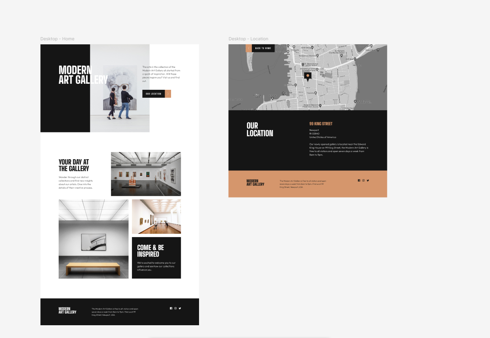
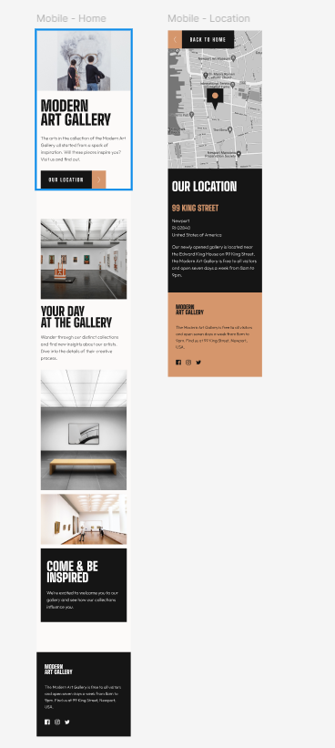
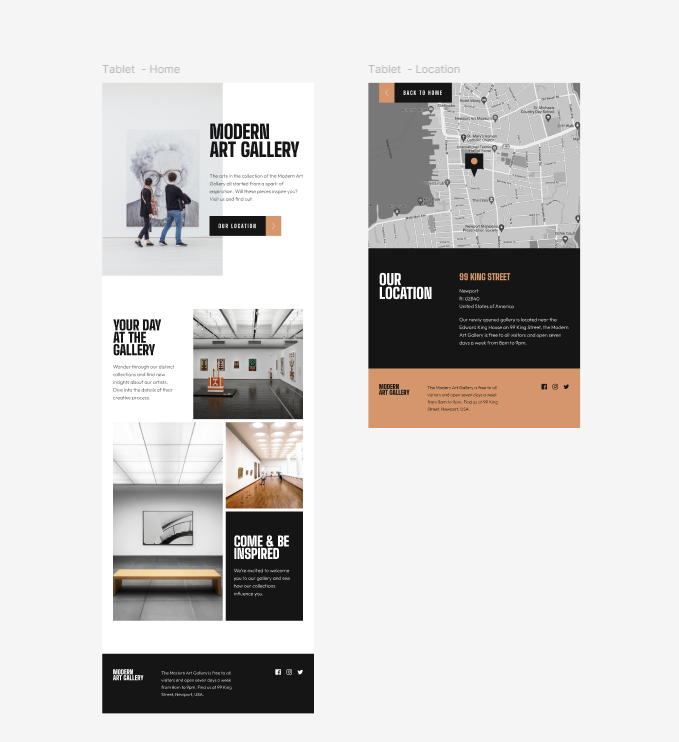

# 🖼️ Modern Art Gallery - Responsive Page

**Descripción breve:**  
Este es un proyecto de landing page para una galería de arte moderna. Incluye una sección principal con llamada a la acción y una vista de localización con mapa integrado. El diseño es totalmente responsive y adaptado para escritorio, tablet y móvil.

---

## 🌐 Ver página en vivo

👉 [Haz clic aquí para ver la landing page](https://matusbh.github.io/CSS-Tarea-entregable-3-Modern-Art-Gallery/)

---

## 🛠️ Tecnologías usadas

- HTML5  
- CSS3 (SCSS)

---

## 🚀 Características

- ✅ Diseño responsive (móvil, tablet, escritorio)  
- ✅ Página principal con llamada a la acción y recorrido visual  
- ✅ Página de ubicación con mapa estático  
- ✅ Tipografía clara y moderna  
- ✅ Estructura semántica y accesible  

---

## 📸 Capturas del proyecto

### 🖥️ Versión escritorio

### 📱 Versión móvil (Home + Location)

### 📱 Versión tablet

---

## 📝 Notas adicionales

Este proyecto está enfocado únicamente al diseño visual responsive con HTML y CSS. No se utilizó JavaScript ni frameworks externos.  
